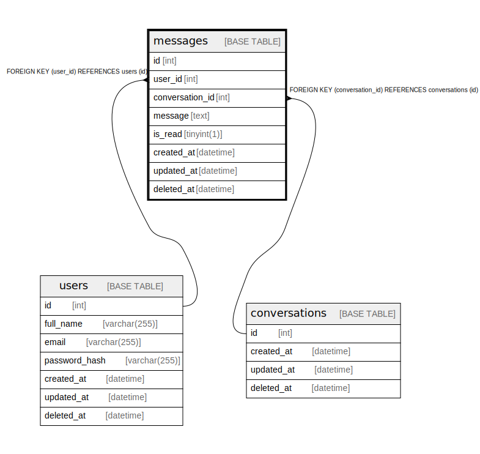

# messages

## Description

<details>
<summary><strong>Table Definition</strong></summary>

```sql
CREATE TABLE `messages` (
  `id` int NOT NULL AUTO_INCREMENT,
  `user_id` int NOT NULL,
  `conversation_id` int NOT NULL,
  `message` text NOT NULL,
  `is_read` tinyint(1) DEFAULT '0',
  `created_at` datetime DEFAULT CURRENT_TIMESTAMP,
  `updated_at` datetime DEFAULT CURRENT_TIMESTAMP ON UPDATE CURRENT_TIMESTAMP,
  `deleted_at` datetime DEFAULT NULL,
  PRIMARY KEY (`id`),
  KEY `user_id` (`user_id`),
  KEY `conversation_id` (`conversation_id`),
  CONSTRAINT `messages_ibfk_1` FOREIGN KEY (`user_id`) REFERENCES `users` (`id`),
  CONSTRAINT `messages_ibfk_2` FOREIGN KEY (`conversation_id`) REFERENCES `conversations` (`id`)
) ENGINE=InnoDB AUTO_INCREMENT=[Redacted by tbls] DEFAULT CHARSET=utf8mb4 COLLATE=utf8mb4_0900_ai_ci
```

</details>

## Columns

| Name | Type | Default | Nullable | Extra Definition | Children | Parents | Comment |
| ---- | ---- | ------- | -------- | ---------------- | -------- | ------- | ------- |
| id | int |  | false | auto_increment |  |  |  |
| user_id | int |  | false |  |  | [users](users.md) |  |
| conversation_id | int |  | false |  |  | [conversations](conversations.md) |  |
| message | text |  | false |  |  |  |  |
| is_read | tinyint(1) | 0 | true |  |  |  |  |
| created_at | datetime | CURRENT_TIMESTAMP | true | DEFAULT_GENERATED |  |  |  |
| updated_at | datetime | CURRENT_TIMESTAMP | true | DEFAULT_GENERATED on update CURRENT_TIMESTAMP |  |  |  |
| deleted_at | datetime |  | true |  |  |  |  |

## Constraints

| Name | Type | Definition |
| ---- | ---- | ---------- |
| messages_ibfk_1 | FOREIGN KEY | FOREIGN KEY (user_id) REFERENCES users (id) |
| messages_ibfk_2 | FOREIGN KEY | FOREIGN KEY (conversation_id) REFERENCES conversations (id) |
| PRIMARY | PRIMARY KEY | PRIMARY KEY (id) |

## Indexes

| Name | Definition |
| ---- | ---------- |
| conversation_id | KEY conversation_id (conversation_id) USING BTREE |
| user_id | KEY user_id (user_id) USING BTREE |
| PRIMARY | PRIMARY KEY (id) USING BTREE |

## Relations



---

> Generated by [tbls](https://github.com/k1LoW/tbls)
